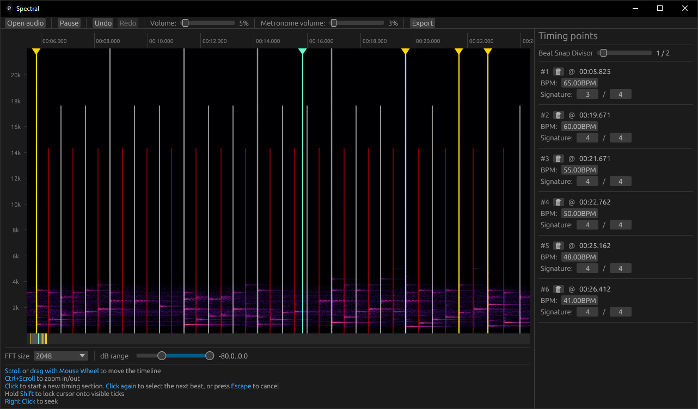

# Spectral

<p align="center">
  
</p>

**Spectral** is a utility for timing songs for use in rhythm games, using a spectrogram as a visual guide.

> [!WARNING]
> The project is in its early stages, expect breakage and very rough UX

> Goals for 1.0 release can be found [here](/TODO.md)

<details>
<summary>Screenshots</summary>

<p align="center">
  
</p>
</details>

## For users

You can download the latest release [here](https://github.com/uzervlad/spectral/releases/latest)

## For developers

#### Prerequisites

* Rust (https://rust-lang.org/)

```bash
$ cargo run --release
```
<sub>It is recommended to run in release mode, since spectrogram rendering can be incredibly slow</sub>
